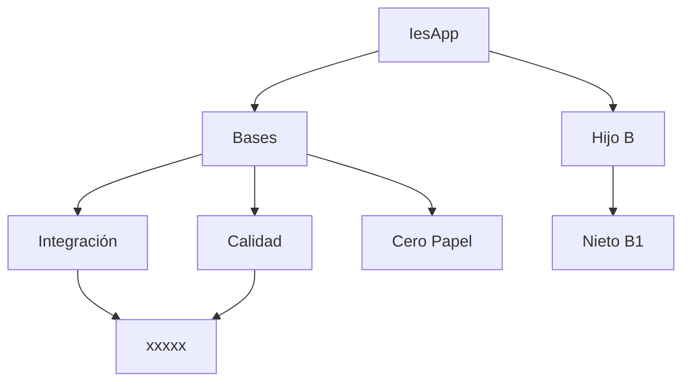
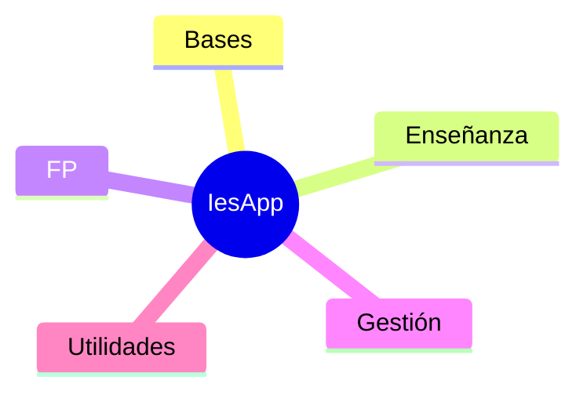

# IesApp

bla bla

**Sistema de Gestión de Centro**

- El trabajo diario en el IES Santiago Hernández gira en buena medida alrededor de IesApp. Facilita la vida a todos los miembros de la comunidad educativa, alumnos, profesores y personal no docente.
- IesApp es un sistema informático creado por Rafael Cabeza, miembro del equipo directivo del IES Santiago Hernández desde julio de 2011.
- El sistema es una aplicación web construida con Laravel, un framework PHP.
- Se inició poco después del nacimiento de SIGAD. El objetivo era facilitar el trabajo dentro del instituto y cubrir algunas deficiencias del sistema informático oficial.
- Inicialmente se buscaron tres funcionalidades:
    - **Disciplina**. SIGAD no cubría las espectativas del sistema de puntos utilizado en el centro y en ese momento se optó por esta vía en lugar de por SIGAD.
    - **Matrícula online**. Se trataba de facilitar el proceso de matrícula y de evitar errores en el mismo cuando estaba basado en papel. Anteriormente había otro sistema más rudimentario basado en Microsoft Access.
    - **Guardias**. En ese momento había un sistema de guardias basado en Microsoft Access y en IES2000. El abandono de este último fue la espoleta para reconstruir el sistema de forma más moderna y accesible desde cualquier navegador.
- Sobre estos tres pilares se fueron ampliando funcionalidades y mejorando la facilidad de uso. Este proceso sigue vivo y cada día la aplicación es un poco mejor.
